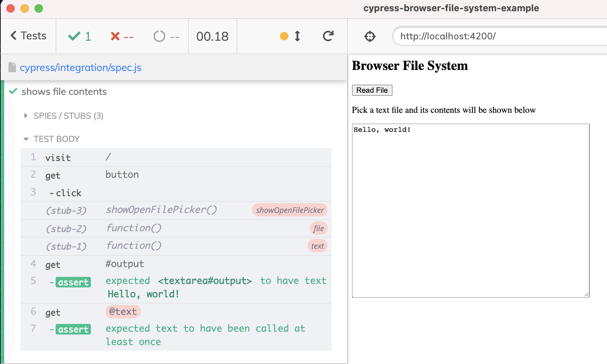

# cypress-browser-file-system-example

> Example testing a browser site that uses the FileSystem API

See [spec.js](./cypress/integration/spec.js) and read the blog post [Test Web Apps That Use The Browser FileSystem API](https://glebbahmutov.com/blog/browser-filesystem-api/).

For more about FileSystem in the browser, read [The File System Access API: simplifying access to local files](https://web.dev/file-system-access/)
